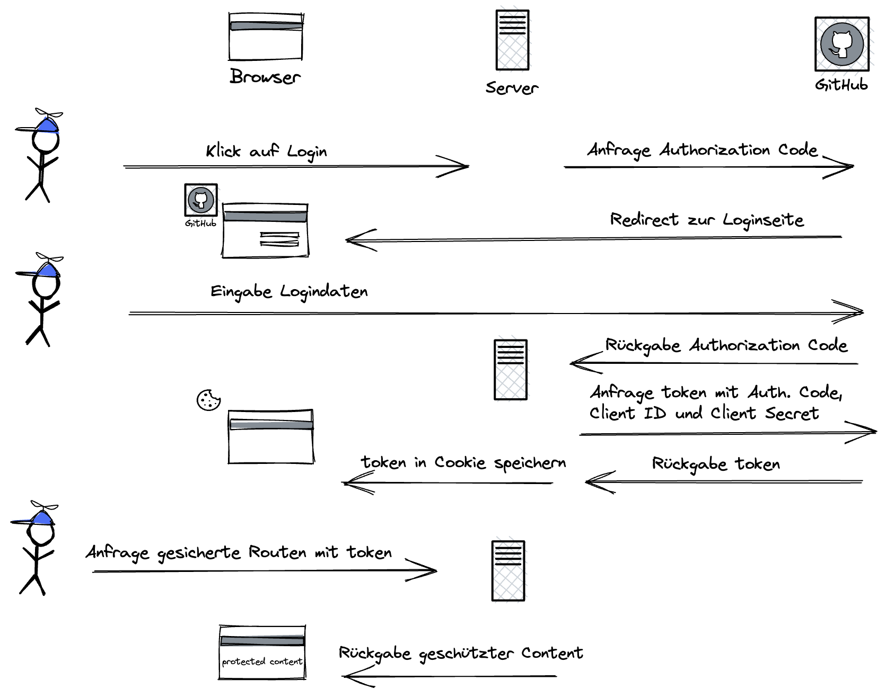

# Authentifizierung mit NextAuth

## Was ist Authentifizierung?

Authentifizierung ist die Verifizierung der Identität eines Benutzers.
Authentifizierung beantwortet die Frage "Wer ist der Benutzer?", Autorisierung
hingegen die Frage "Was darf der Benutzer?"

## Warum brauchen wir das?

Viele unserer Apps erlauben es dem Benutzer, eigene Daten zu speichern und
wieder abzurufen.

Um die Daten eines Benutzers vor dem Zugriff anderer Benutzer zu schützen,
müssen wir dafür sorgen, dass unsere API geschützte Daten nur an einen
authentifizierten User zurückgibt.

Außerdem möchten wir in unserer Web-App bestimmte Funktionalitäten nur für
angemeldete Nutzer sichtbar machen und den Nutzer z.B. mit seinem Namen begrüßen
können.

## Was sind Authentication Provider?

Authentication Provider sind Institutionen/Systeme, die die Identität eines
Nutzers für uns überprüfen. Bekannte Authentication Provider sind z.B. Google,
Facebook oder (unter Entwicklern) Github.

Hat sich ein Nutzer erfolgreich authentifiziert, stellen die Systeme ihm einen
zeitlich begrenzten "Pass" in Form eines digital signierten
Authentifizierungs-Tokens aus. Mit diesem Token ruft der Nutzer dann unsere
geschützten API-Routen auf. Da wir dem Authentication Provider und der digitalen
Signatur vertrauen, können wir den privaten Content des Users ausgeben.

## Was passiert im Hintergrund?

## Was ist NextAuth?

NextAuth ist ein Package, das uns sehr viele Aspekte des
Authentifizierungs-Flows abnimmt, insbesondere die Kommunikation mit den
Authentication Providern und den Zugriff auf Informationen zum eingeloggten
